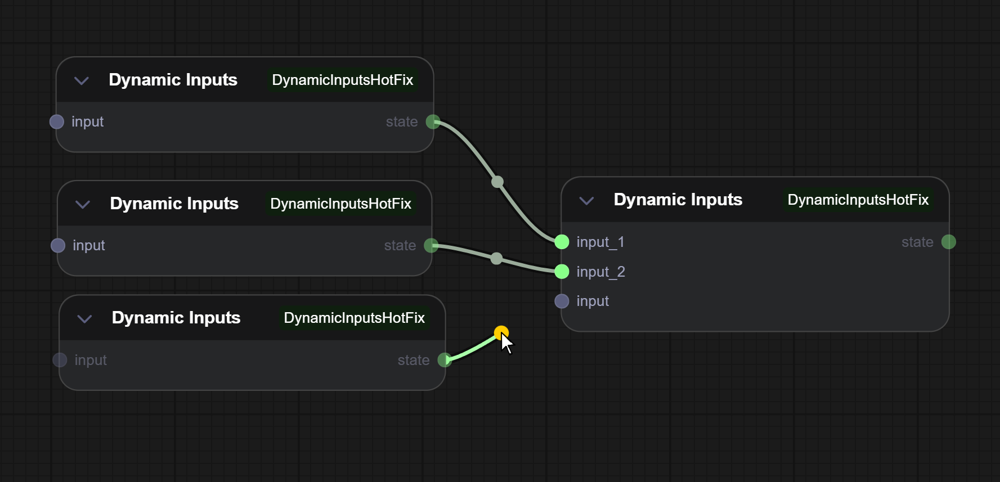

# ComfyUI-DynamicInputsHotFix

Workarounds for dynamic input rendering bugs in ComfyUI's Vue frontend.



## What Are Dynamic Inputs?

Dynamic inputs allow a node to spawn unlimited input sockets on-the-fly as you connect wires to it. Instead of having a fixed number of inputs, the node automatically creates new slots when you connect something, and removes them when you disconnect. This is useful for nodes that need to accept a variable number of inputs (like merge nodes, concat nodes, etc.).

The technique uses the `*` (asterisk) type to accept any connection, then inherits the actual type from whatever gets connected. Credit to [cozy_ex_dynamic](https://github.com/cozy-comfyui/cozy_ex_dynamic) for the original implementation pattern.

## The Problem

Since the Vue nodes merge (~September 2025), custom nodes using dynamic inputs (`this.addInput()` in JavaScript) have visual bugs:

1. **New slots don't render** until page refresh
2. **Slot colors don't update** when type changes on connect
3. **Slot colors stay stale** after disconnect (unfixable from extension)

This affects any node using `addInput()`/`removeInput()` in `onConnectionsChange`, including [cozy_ex_dynamic](https://github.com/cozy-comfyui/cozy_ex_dynamic) and similar.

## What This Provides

- **Example node** (`Dynamic Inputs`) demonstrating working dynamic inputs
- **Workarounds** documented in code that other node authors can copy
- **Bug documentation** with root cause analysis

## Installation

```bash
cd ComfyUI/custom_nodes
git clone https://github.com/YOUR_USERNAME/ComfyUI-DynamicInputsHotFix
```

Restart ComfyUI. Find "Dynamic Inputs" node under `DynamicInputsFix` category.

## Workarounds for Node Authors

### 1. Trigger Vue Refresh Event

After modifying inputs, manually trigger the event that Vue listens for:

```javascript
this.graph?.trigger?.('node:slot-links:changed', {
    nodeId: this.id,
    slotType: 1,  // INPUT
    slotIndex: slot_idx,
    connected: isConnect,
    linkId: link_info?.id ?? -1
});
this.graph?.setDirtyCanvas?.(true, true);
```

### 2. Replace Slot Object on Type Change

When changing a slot's type, replace the object to trigger Vue reactivity:

```javascript
node_slot.type = parent_link.type;
this.inputs[slot_idx] = { ...node_slot };  // Creates new object reference
```

### 3. CSS for Custom Type Colors

Vue ignores `color_on`/`color_off`. Inject CSS instead:

```javascript
const style = document.createElement('style');
style.textContent = `
    :root {
        --color-datatype-\\*: #888;
        --color-datatype-MYCUSTOMTYPE: #f80;
    }
`;
document.head.appendChild(style);
```

## Known Limitations

**Disconnect color bug is unfixable** from extensions. When disconnecting, the new empty slot keeps the old slot's color until page refresh. This requires an upstream fix to `NodeSlots.vue` (using better component keys).

See [COMFYUI_DYNAMIC_INPUT_BUG.md](COMFYUI_DYNAMIC_INPUT_BUG.md) for full technical details.

## License

MIT
